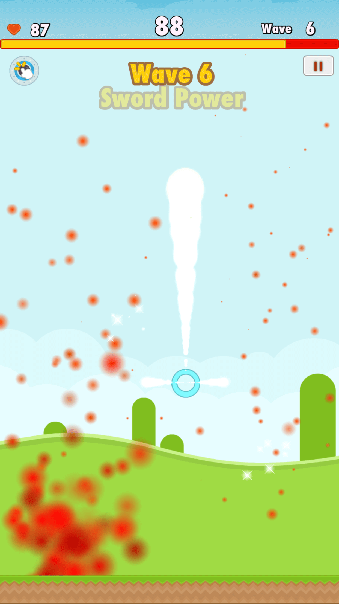
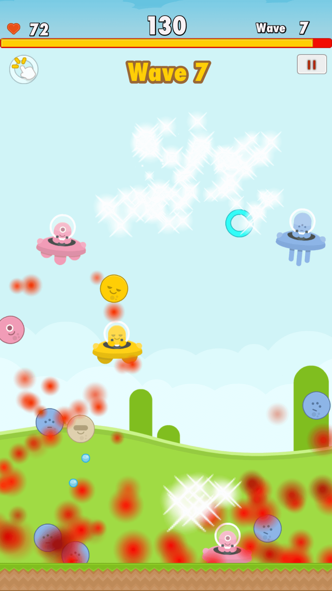
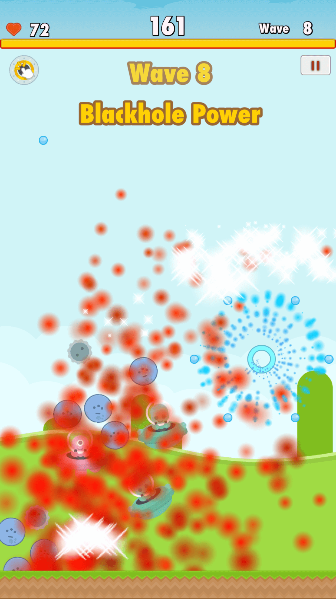

This is cute cartoon style game, code with Swift 2, Coco2d and Spritebuilder. The game have clear code structure, easy to modify to your own needs, other games types, like Aircraft fight.

  

    
  

  

    
  

  

    
  

### Game Features:

- Three different power weapon with particles effects
- Use finger gesture to destroy enemies
- Auto Level Generator, easy to customise parameters
- Game UI, physis objects, audio effect
- Integrated Google Analytics
- Integrated Google AdMob
- Integrated Parse.com with Push Notification
- Integrated Game Center

### Introduction for beginer:

1. Download and extract the project.
2. Download spritebuilder from https://s3.amazonaws.com/ivoicerweb/SpriteBuilder.zip
   Detail please read : http://www.spritebuilder.com/
3. Download Cocoapod and run command in terminal : pod install
4. Use XCode to open .xcworkspace project to modify code
5. Use spritebuilder the open the project folder to edit game elements (You might need change project folder name some thing like 'AlienBlastSwift.spritebuilder')
6. Export project from spritebulder (Important!)
7. Compile the project from XCode and enjoy it :)

### Build project for developer:

> git clone https://github.com/etamity/AlienBlast.git

> pod install

> open with xcode, and build

> enjoy it :)

### Description

The aliens are coming and their goal is to invade and destroy Earth. Fighting superior technology, mankind’s best weapon is the will to survive. Use your finger defend our world!
Game also available at [App Store](https://itunes.apple.com/us/app/id1098323034), you can watch [Youtube Preview](https://www.youtube.com/watch?v=_uYs9T0X9L4)

<iframe width="560" height="315" src="https://www.youtube.com/embed/QokCwI30LXc" frameborder="0" allow="accelerometer; autoplay; encrypted-media; gyroscope; picture-in-picture" allowfullscreen></iframe>
