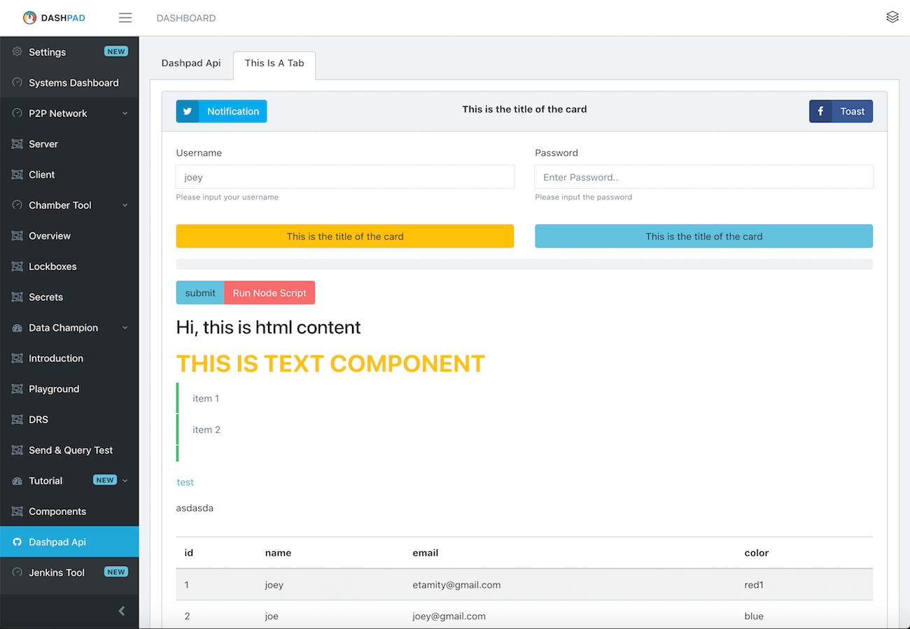
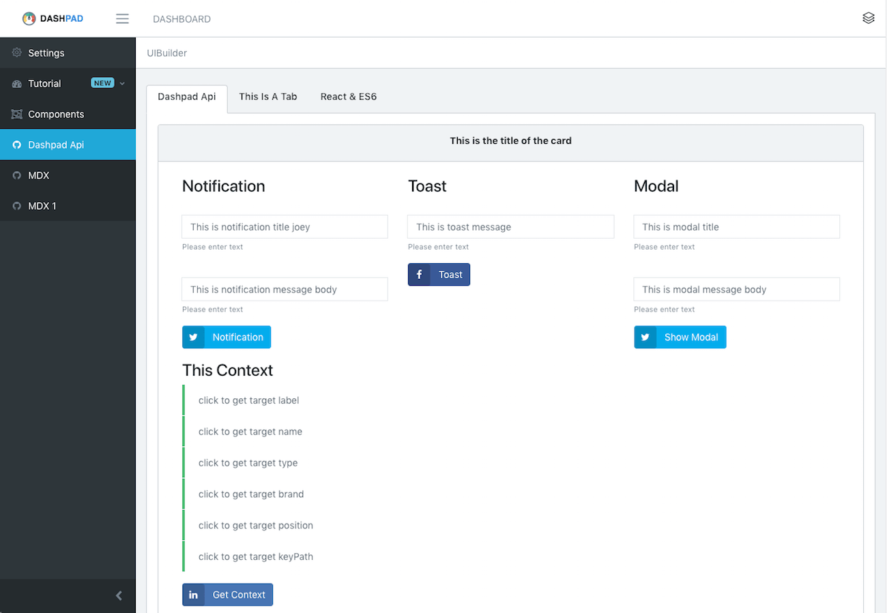

## Background

Nowadays, the speed of the technology development like it’s accelerating, it can be measured in the “returns” of the technology—such as speed, efficiency, price-performance, and overall “power”—which improve exponentially too.

However, fast pace acceleration brings side effect to all engineers, we are exhausted to adapt, to learn, to try new tech, we are running out of our energy, time, and mental loads, which decrease our productivity.

When we sit in front of our computer, face so many technologies out there, we need to deal with Github, Jenkins, cloud service, deployment pipeline, confluence documents and so on, daily, we have spent so much time on context switching, debugging, repeat the work that other people have already done, how frustrating is that !

## What is Dashpad?

Dashpad is a hackable universal desktop dashboard framework for your automation task and visualize tooling.

This framework aims to solve out the problem we are having, we write scripts, tools or pipeline once, make it configurable, with nice user interface, and share them with other engineers, they can reuse the work that we’ve done, they can spend more time on focusing other areas they are familiar with.

  

    
  

  

    
  

Every scripts or tools are meant to solve some sort of problems, witch mean we can gather different sector of engineers together who is facing the same problem, as a problem-solving group.

With Dashpad, we can make tools, write scripts or pipeline, and port it to a desktop dashboard ui, and share it across their network/sector, eventually everyone will benefit from it.

[docs](https://etamity.github.io/dashpad/)

## Video Demo

<iframe width="560" height="315" src="https://www.youtube.com/embed/xdE6z8N6nyw" frameborder="0" allow="accelerometer; autoplay; encrypted-media; gyroscope; picture-in-picture" allowfullscreen>
</iframe>

[Tutorial Module](https://github.com/etamity/dashpad-tutorial)

## Environment Requirement

- Node >= v8.16.0

    If we get `fsevents.watch is not a function` error, try to change node version greater than v8.16.0.

### Getting Started

To get started developing

#### Set the monorepo up in dev mode

Requires [Node.js](https://docs.npmjs.com/getting-started/installing-node) and [yarn](https://yarnpkg.com/lang/en/docs/install/).

1. Fork this repo
2. Clone your fork or this repo `git clone https://github.com/etamity/dashpad`
3. `cd` to the directory where we `clone`d it

## Install

    yarn install

## Start

    yarn start 

## build

Your built version will be under `build` folder.

    yarn build

## Bundle

Your bundled version will be under `dist` folder.

    yarn pack:mac
